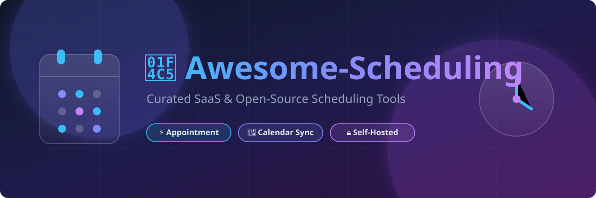

# Awesome-Scheduling 📅

  

  
  
  
  
  
  

## 🚀 Top Scheduling Tools Ecosystem

**Curated List of SaaS/Commercial Products & Open-Source GitHub Projects**  
*Focused on Appointment Booking 🗓️, Meeting Scheduling ⏰, Availability Sharing 🔗, Team Round-Robin 👥 & Calendar Automation ⚡*  

**Last updated: August 2026** 📌

---

### 🌟 Overview & Key Concepts

This repository tracks top-tier **SaaS platforms** and **open-source projects** for **Scheduling & Appointment Management**. These tools help individuals, enterprises, and service businesses share availability, coordinate multi-person meetings, manage custom event types, eliminate back-and-forth email loops, and integrate seamlessly with Google Calendar, Outlook, Office 365, Zoom, Microsoft Teams, and Stripe payments.

Whether you need a commercial turnkey booking service or a privacy-first, self-hosted scheduling infrastructure, this list covers the best solutions available today.

---

## 📚 Table of Contents

- [🏢 SaaS/Hosted Platforms](#-saashosted-platforms)
- [🔓 Open-Source GitHub Projects](#-open-source-github-projects)
- [🤝 How to Contribute](#-how-to-contribute)
- [⭐ Star History](#-star-history)
- [⚠️ Disclaimer](#%EF%B8%8F-disclaimer)

---

## 🏢 SaaS/Hosted Platforms

SaaS appointment schedulers ordered by company scale (revenue & valuation descending):

| Platform | Description | Estimated Size (Revenue / Valuation) | Starting Price | Free Tier Limits |
| :--- | :--- | :--- | :--- | :--- |
| **[Zoho Bookings](https://www.zoho.com/bookings/)** 💼 | Appointment scheduling platform integrated with the Zoho suite and payment gateways. | ~$1.5B Revenue ($12.5B Valuation) | $6/user/month (billed annually) | Free forever; limited to 1 user with basic appointment scheduling. |
| **[Calendly](https://calendly.com/)** 📅 | Category leader for sharing availability, booking meetings, round-robin, and CRM workflows. | ~$275M ARR ($3.0B Valuation) | $10/user/month (billed annually) | Free forever; limited to 1 active event type and 1 connected calendar. |
| **[Acuity Scheduling](https://acuityscheduling.com/)** ⏱️ | Squarespace-owned booking platform with rich client management and custom booking intake forms. | ~$200M ARR (Part of Squarespace) | $16/month (billed annually) | No free forever plan; offers a 7-day free trial. |
| **[Cal.com (Hosted)](https://cal.com/)** 📆 | Hosted cloud version of open-source scheduling platform with team routing, workflows, and white-labeling. | ~$5.1M ARR ($150M Valuation) | $12/user/month (billed annually) | Free forever for individuals; includes unlimited event types and calendar connections. |
| **[OnceHub](https://www.oncehub.com/)** 🔀 | Comprehensive appointment scheduling and lead routing platform for service and sales teams. | ~$30.5M ARR (~$91.5M Valuation) | $10/user/month | Free forever; limited to 1 user and 1 active booking link. |
| **[SimplyBook.me](https://simplybook.me/)** 🛍️ | Feature-rich service booking software for businesses with staff scheduling and online payments. | ~$5.4M ARR (~$16.2M Valuation) | $8.25/month (billed annually) | Free forever; limited to 50 bookings/month and 1 user provider. |
| **[YouCanBookMe](https://youcanbook.me/)** 📊 | Established booking page tool for consultants, educators, and customer-facing teams. | ~$5.0M ARR (Bootstrapped) | $9/month (billed annually) | Free forever; limited to 1 calendar connection and 1 booking page. |
| **[SavvyCal](https://savvycal.com/)** 🎯 | Modern scheduling tool emphasizing personalized booking links, overlay calendars, and refined UX. | ~$1.0M ARR (~$3.0M Valuation) | $12/user/month ($10/mo billed annually) | Free plan allows account setup, calendar overlay, and meeting polls, but active booking link activation requires a paid plan. |
| **[Doodle](https://doodle.com/)** 🗳️ | Popular group scheduling, poll creation, and 1:1 meeting coordination tool. | Undisclosed (TX Group Subsidiary) | $6.95/user/month (billed annually) | Free forever; limited to 1 booking page and 1 active 1:1 meeting (ad-supported, no calendar sync). |
| **[Bookafy](https://www.bookafy.com/)** 🖥️ | Service and appointment booking tool with automated video link generation and multi-staff options. | Undisclosed (~$2M ARR estimate) | $9/month | Free forever; limited to 1 user with no automated two-way calendar sync. |

---

## 🔓 Open-Source GitHub Projects

Self-hosted scheduling and appointment management repositories, sorted by GitHub star count (descending):

- **[Cal.com / Cal.diy](https://github.com/calcom/cal.com)**  ⚡  
  Leading open-source scheduling infrastructure (originally Calendso). Provides Calendly-style booking pages, event types, team scheduling, round-robin, workflows, payments, and extensive integrations. Fully self-hostable (Next.js, Prisma, Tailwind).

- **[Easy!Appointments](https://github.com/alextselegidis/easyappointments)**  🗓️  
  Mature, fully open-source (GPLv3) web appointment booking system. Supports services, providers, customer management, email notifications, and Google Calendar sync — ideal for clinics, salons, consultants, and service businesses (PHP/CodeIgniter).

- **[Rallly](https://github.com/lukevella/rallly)**  🗳️  
  Open-source group scheduling and polling tool (Doodle alternative). Lets participants vote on preferred meeting times without requiring accounts for basic use; clean TypeScript/Next.js stack.

- **[Nextcloud Calendar](https://github.com/nextcloud/calendar)**  ☁️  
  Integrated calendar and appointment booking capabilities within the self-hosted Nextcloud ecosystem, enabling custom availability slots, CalDAV synchronization, and internal team scheduling.

- **[Django-Appointment](https://github.com/adamspd/django-appointment)**  🐍  
  Extensible Django package for handling appointment booking workflows, custom service durations, staff slot management, and automated email confirmations in Python web apps.

- **[AppointmentScheduler](https://github.com/slabiak/AppointmentScheduler)**  ☕  
  Full-featured open-source appointment booking web application built with Java, Spring Boot, and Thymeleaf. Supports customer appointment requests, working hours configuration, and provider assignment.

- **[Tymeslot](https://github.com/amamenko/GlowLabs)**  ⏱️  
  Modern meeting scheduling engine built with Elixir and Phoenix LiveView for fast real-time availability updates, interactive booking, and Docker-based self-hosting.

- **[Open-Salon](https://github.com/clawnify/open-salon)**  💇  
  Modern lightweight booking software for personal service businesses (salons, spas, barbershops) built using Preact, Hono, and SQLite with staff schedule management.

- **[PodCal](https://podcal.eu/)** 🔒  
  Privacy-first open-source scheduling tool built on Solid Pods. Supports self-hosting, CalDAV sync, and total user data ownership under an MIT license.

- **[Thunderbird Appointment](https://appointment.day/)** ✉️  
  Community-driven open-source scheduling helper focused on lightweight availability sharing and simple calendar booking flows.

---

### 🛠️ Additional Open-Source & Custom Architecture Options

- **CalDAV / iCal Booking Engines**: Custom booking front-ends built directly on top of CalDAV servers (Baïkal, Radicale, Sabre/dav).
- **Form + Calendar Automation**: Combining open-source form builders (Formbricks, Typebot) with calendar APIs and webhooks.
- **Static Availability Pages**: Lightweight static site generator scripts publishing availability from iCal feeds.

---

## 🤝 How to Contribute

1. Fork the repository 🍴
2. Add or update entries in `README.md` following the established table / list schema.
3. Ensure descriptions are objective and link directly to official project repositories or websites.
4. Submit a Pull Request with a clear description of your additions! 🚀

---

## ⭐ Star History

<a href="https://www.star-history.com/?repos=ishandutta2007%2FAwesome-Scheduling&type=date&legend=bottom-right">
<picture>
<source media="(prefers-color-scheme: dark)" srcset="https://api.star-history.com/chart?repos=ishandutta2007/Awesome-Scheduling&type=date&theme=dark&legend=bottom-right" />
<source media="(prefers-color-scheme: light)" srcset="https://api.star-history.com/chart?repos=ishandutta2007/Awesome-Scheduling&type=date&legend=bottom-right" />

</picture>
</a>

---

## ⚠️ Disclaimer

- This list is **community-curated** for informational and educational purposes — it is not exhaustive and does not constitute an endorsement.
- Scheduling platforms handle sensitive availability, calendar metadata, customer contact details, and payment transactions. Always audit privacy policies and security posture before integrating.
- For open-source self-hosted options, evaluate production readiness, licensing terms, and maintenance requirements carefully.

---

  <b>Made with ❤️ for freelancers, engineers, and teams seeking efficient, privacy-respecting meeting scheduling.</b>

